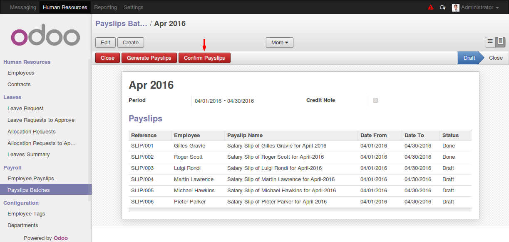
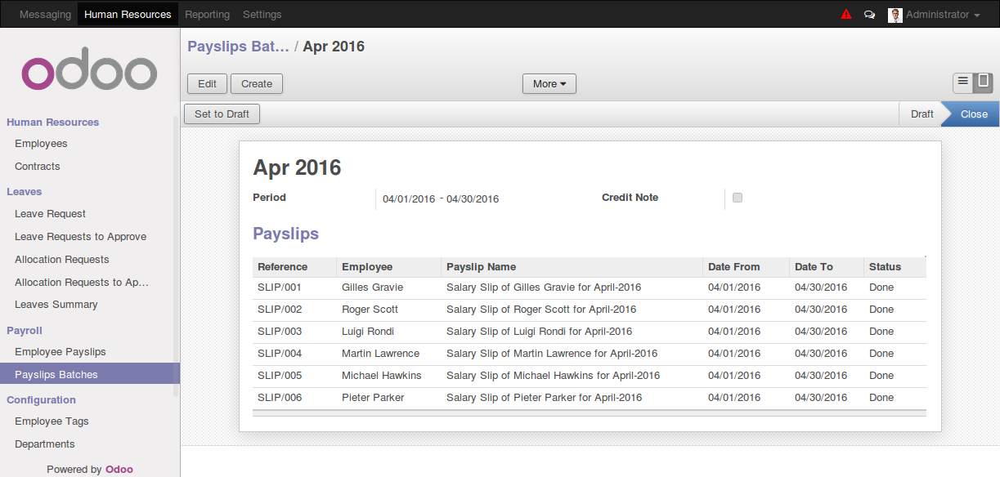

# odoo_payroll

Some useful features for odoo payroll.

## payslip_batch_confirm

This is a very small but useful feature/module. Here you can confirm all payslips in a batch by single click.

"Confirm Payslips" button is only available if batch is not closed.

